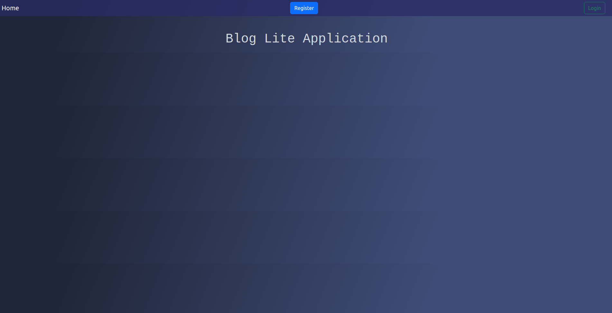

# Blog Lite Application
## About
This project is a lightweight blogging platform designed for seamless content creation and social interaction. It allows users to write blogs, search other users, follow other users, and receive daily reminders.

## Features
* JWT-Based Authentication: Secure login and session management using JSON Web Tokens.
* Blog Management: Create, edit, and delete blogs through Flask API endpoints.
* Follow System: Follow/unfollow users to personalize content feeds.
* Search Functionality: Search users or blogs efficiently using Redis caching.
* Performance Optimization: Leverages Redis to minimize database queries and enhance response times.
* Daily Reminders: Automated notifications sent via Google Chat API with email integration.

## Methodology
1. User Authentication:
    * Implemented JWT for secure user sessions and token-based access.
    * Stored securely hashed passwords in an SQLite database.

2. Blog Management:
    * Created RESTful APIs using Flask to allow CRUD operations for blogs.
    * Built a following system to deliver a personalized user feed.

3. Search and Optimization:
    * Enabled search functionality with Flask and optimized responses using Redis caching.

4. Batch Jobs:
    * Scheduled tasks with Redis and Celery for background operations such as sending daily reminders.
    * Integrated Google Chat API for sending notifications via email.

5. Front-End Interface:
    * Designed a dynamic and responsive UI using Vue.js to provide users with an intuitive experience.
  
## Tech Stack
* Back-End:
    * **Flask:** To build the API for blog management and user interactions.
    * **SQLite:** Lightweight database to store user data, blogs, and relationships.
    * **Redis:** For caching and background task management.
    * **Celery:** To handle asynchronous batch jobs.

* Front-End:
    * **Vue.js:** For building an interactive and responsive web interface.

* Authentication:
    * **JWT:** To ensure secure user sessions.

* Notifications:
    * **Google Chat API:** For sending daily reminders and email notifications.

